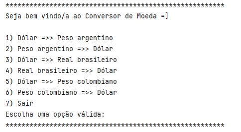
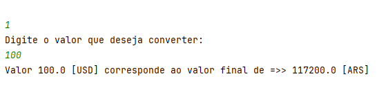

<h1>Conversor de Moedas</h1>
Este é um projeto proposto pela Alura, como desafio para aplicação do conteúdo ensinado. Foi desenvolvido em java utilizando a ExchangeRate-API. A biblioteca externa utilizada foi a GSON 2.10.1.
 
<h2>Funcionalidades</h2>
<ul>
    <li>Conversor de moeda, conforme a cotação atual</li>
    <li>Menu interativo</li>
    <li>Tratamento de entrada inválida</li>
</ul>
<h2>Telas</h2>
 

    

    

